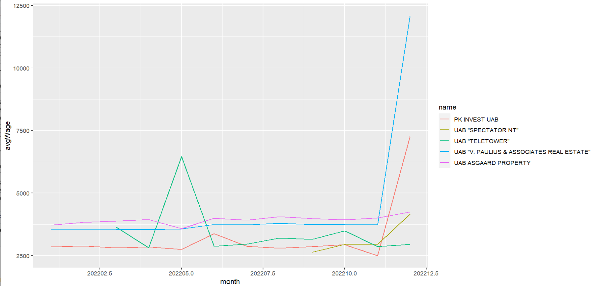

# R Laboratorinis darbas: duomenų vizualizacija

| Variantas | ecoActCode |
|------------- | ------------- |
|17   | 681000 |

### 1. Užduotis

Atsakymas:

Išvados:
 Pagal turimus duomenis ir iš histogramos galime matyti, kad vidutinis lygis svyruoja nuo 0 iki 12000 (valiutos vienetų), tačiau dažniausiai pasitaikantis variantas yra tarp 0 ir 4000

### 2. Užduotis

Atsakymas:

Išvados:
Daugiausiai pakilęs atlyginimas yra įmonėje UAB "V. PAULIUS & ASSOCIATES REAL ESTATE", sumažėjęs nuo 2022 02 iki 2022 12 yra įmonėje UAB "TELETOWER"
### 3. Užduotis

Atsakymas:

Išvados:
Iš grafiko matoma, kad daugiausiai apdraudusi įmonė yra UAB "Teletower", mažiausiai - UAB "Spectator NT"

### 4. Užduotis

Shiny R aplikacijos nuotrauka:

